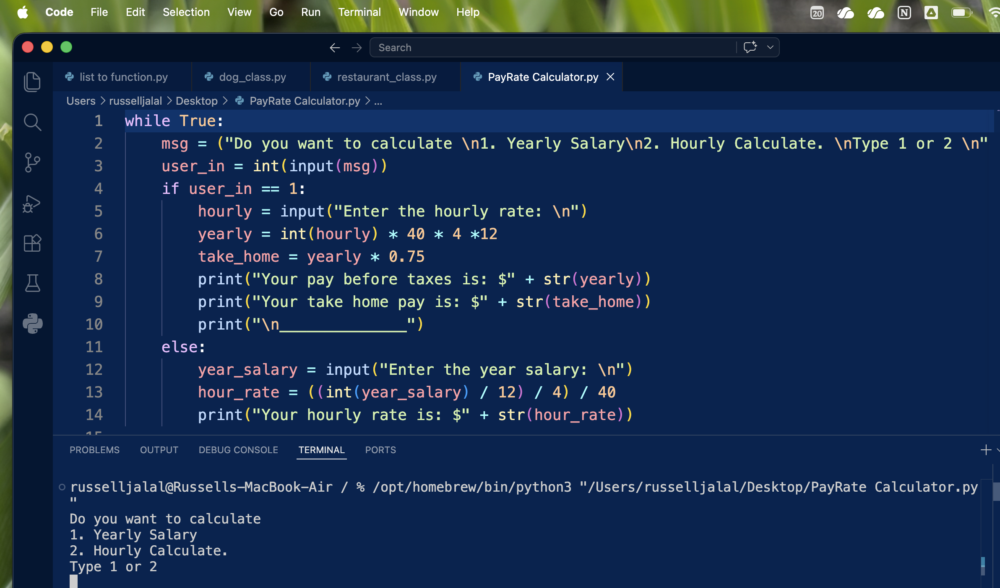

# Python Salary Converter Hourly --> Yearly & Vice Versa
This python scripts calculates hourly job rate from a given yearly rate and vice versa and it also takes into account that taxes will be deducted.

## Why did I create this?
---
- As a Cyber Security student I have been looking at a lot of job openings. 👀😅
- I found myself doing this math quient frequently (Hourly$ --> Yearly$)
- So why not make a Python program for it?

Note: My program takes into account that about 25% of the salary will be deducted for taxes. You can customize it to your liking. 
